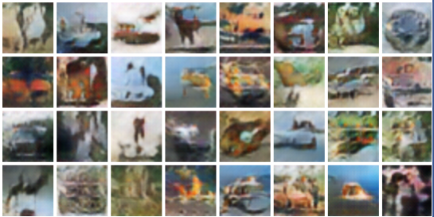

# pytorch.generative.learning

This repository is for learning generative models using PyTorch.

## Requirements

* Python >= 3.6
* PyTorch ==  0.3.1
* torchvision == 0.2
* numpy
* tqdm
* visdom

## Contents

### GANs `gans`
* [(Vanilla) GAN](https://arxiv.org/abs/1406.2661)
* [DCGAN (Deep Convolutional Generative Adversarial Network)](https://arxiv.org/abs/1511.06434): `python dcgan.py`

* [WGAN (Wasserstein GAN)](https://arxiv.org/abs/1701.07875) `python wgan.py`
